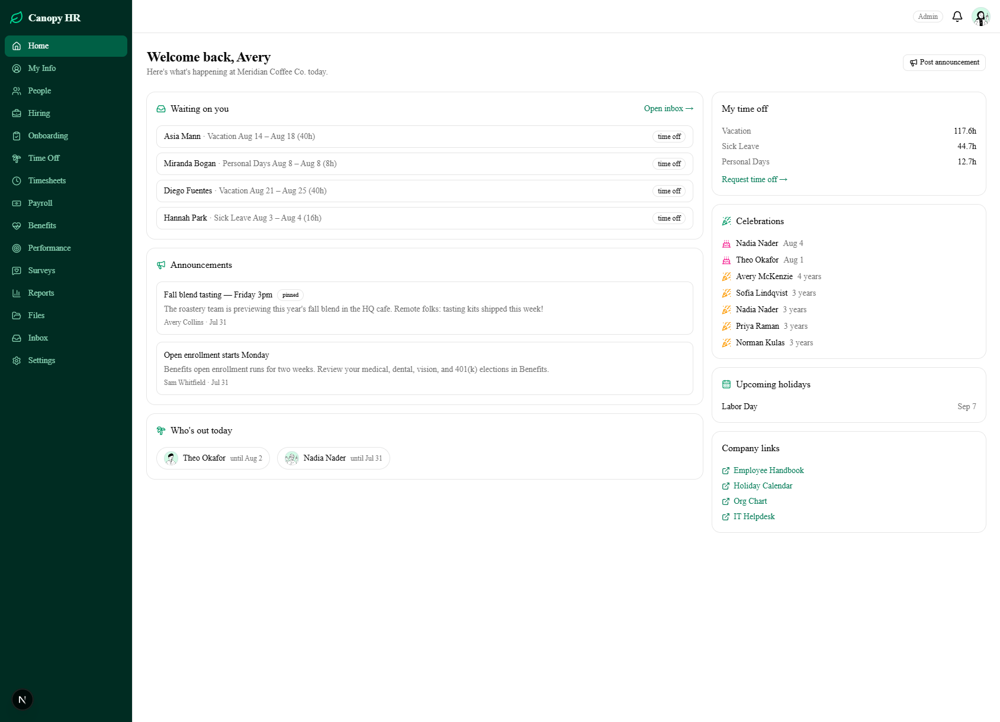
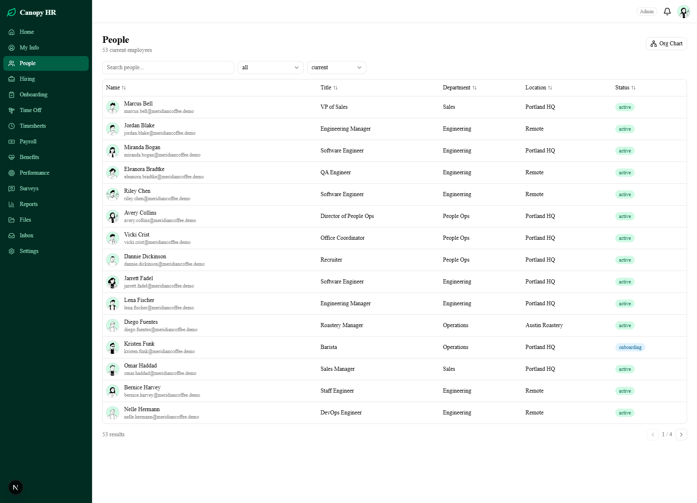
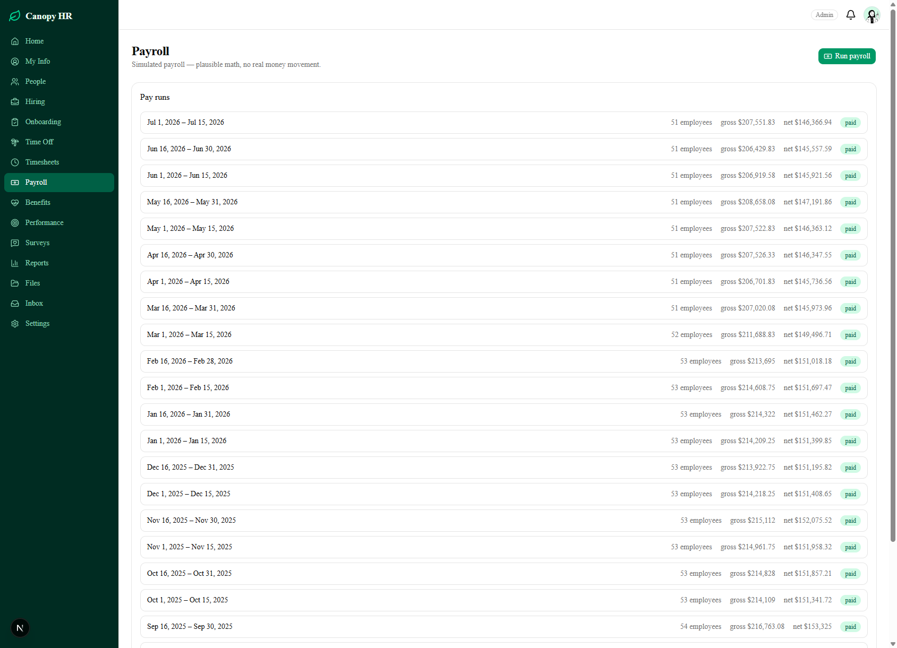
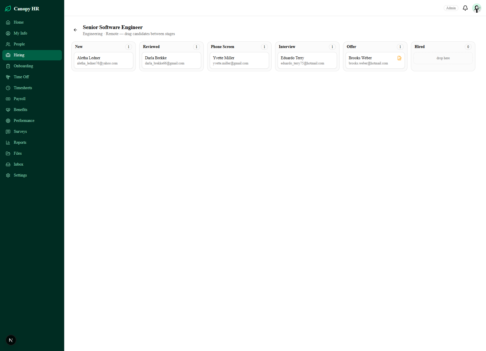
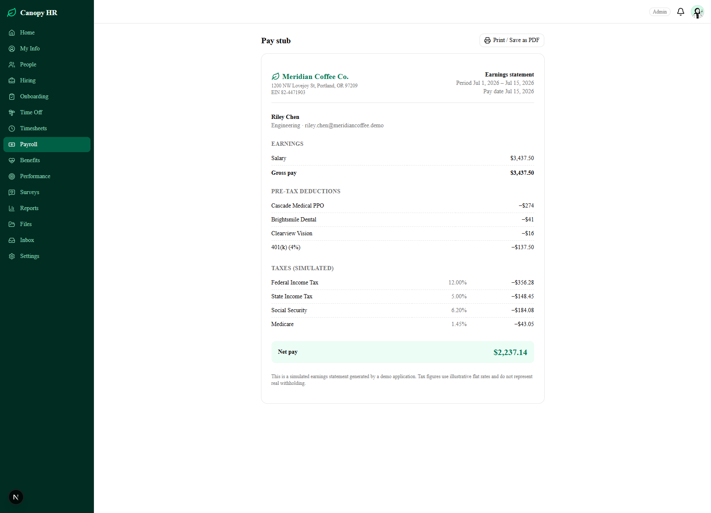
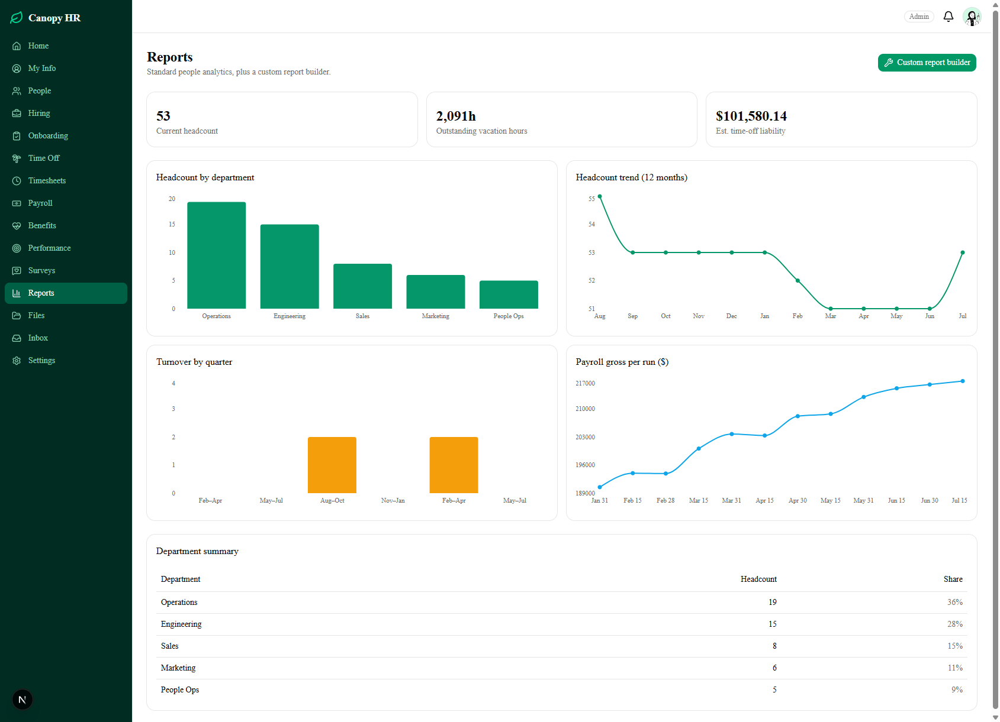

# 🌿 Canopy HR

**A full-featured HR platform** — people records, hiring, onboarding, time off, timesheets, payroll, benefits, performance, surveys, and reporting — built as a complete, working demonstration of a modern HRIS.

> **Live demo:** _deployment pending — see [DEPLOYMENT.md](DEPLOYMENT.md)_
> **Demo company:** Meridian Coffee Co. — 57 seeded employees with 18 months of history.

## Try it — demo accounts

The login page has one-click cards for each role, or sign in directly:

| Role | Email | Password | Start here |
|---|---|---|---|
| **Admin (HR)** | `admin@canopyhr.demo` | `canopy-demo` | Run payroll, approve requests, check Reports & Settings |
| **Manager** | `manager@canopyhr.demo` | `canopy-demo` | Approve time off & timesheets in Inbox, write team reviews |
| **Employee** | `employee@canopyhr.demo` | `canopy-demo` | Request PTO, clock in, view pay stubs, sign the handbook |

There's also a **public careers page** at `/careers` — submit an application and watch it land in the hiring pipeline.

## Screenshots

| | |
|---|---|
|  |  |
|  |  |
|  |  |

## Feature coverage

| Module | Status |
|---|---|
| Home dashboard (announcements, celebrations, who's out, approvals) | ✅ |
| People: directory, profiles, effective-dated job & comp history, org chart, custom fields | ✅ |
| Self-service info changes routed through manager → HR approval | ✅ |
| Hiring: public careers page, drag-and-drop pipeline, offers, hire → employee conversion | ✅ |
| Onboarding & offboarding checklists (templated, auto-created on hire) | ✅ |
| Time off: accrual ledger, balances, request/approve, team calendar, holidays | ✅ |
| Timesheets: clock in/out, manual entries, weekly overtime, approval | ✅ |
| Payroll *(simulated)*: draft → approve → paid runs, printable pay stubs | ✅ |
| Benefits *(simulated)*: plan catalog, open-enrollment elections feeding payroll | ✅ |
| Performance: review cycles (self/manager/peer), goals with check-ins, 1:1s | ✅ |
| eNPS surveys — anonymous by construction, results dashboard | ✅ |
| Reporting: standard analytics + custom report builder with CSV export | ✅ |
| Files & e-signature (typed-name simulation) with notifications | ✅ |
| Settings: company profile, permissions matrix, custom fields, holidays, audit log | ✅ |
| Role-based access (Admin / Manager / Employee), enforced server-side | ✅ |
| Mobile-responsive throughout (bottom nav on small screens) | ✅ |

## What's simulated — and why

This is a demo, so anything that would touch the real world is simulated deliberately: payroll taxes use illustrative flat rates (12% federal, 5% state, 6.2% Social Security, 1.45% Medicare) rather than real withholding tables; no money moves; e-signatures are typed-name capture; and notifications are in-app rather than email. Everything else — accrual math, overtime splitting, gross-to-net computation, approval chains — is real, running logic with unit tests.

## Architecture notes

**Stack:** Next.js 16 (App Router, Server Components + Server Actions), TypeScript, Prisma 7 + PostgreSQL, Auth.js v5 (JWT + credentials), Tailwind 4 + shadcn/ui, TanStack Table, Recharts, dnd-kit, Vitest.

Three design decisions worth calling out:

1. **Effective-dated history** — `JobInfo` and `Compensation` are append-only rows with no end dates; "current" is simply the row with the greatest `effectiveDate ≤ today`. Promotions, history tabs, and as-of reporting fall out for free, with no overlapping-range bugs. ([schema](prisma/schema.prisma))
2. **Time-off balances are a ledger** — balances are never stored; they're `SUM(ledger entries)`. Scheduled accruals materialize lazily on read, idempotent via a unique `(employee, policy, periodKey)` constraint — so there's no cron job to break, and every balance is auditable. ([engine](src/lib/timeoff/accrual.ts), unit tested)
3. **One polymorphic approval engine** — time off, timesheet, and info-change requests all flow through a single `ApprovalRequest` model with an ordered step chain (manager → HR), a single inbox UI, notifications, and per-type side effects on final approval. ([engine](src/lib/approvals.ts))

Also: RBAC is enforced in the server layer (`src/lib/authz.ts` — every Server Action guards itself; UI hiding is cosmetic), every mutation writes an `AuditLog` row, pay stub lines are snapshotted JSON so approved history never changes, and survey responses are anonymous *by construction* (the response row has no employee reference; participation is tracked in a separate table).

The full domain model (~44 models) lives in [`prisma/schema.prisma`](prisma/schema.prisma).

## Run it locally

```bash
git clone https://github.com/TokkatheDj/canopy-hr && cd canopy-hr
npm install
npm run db:dev        # real PostgreSQL via embedded-postgres — keep this running
# in a second terminal:
cp .env.example .env  # the db:dev output shows the DATABASE_URL to paste in
npx prisma migrate deploy
npm run db:seed
npm run dev
```

Then open http://localhost:3000 and use a demo login above. `npm test` runs the payroll / accrual / overtime engine tests.

## Disclaimer

Canopy HR is an original demo application inspired by the feature set of commercial HRIS products. It uses no third-party branding or assets, and all people and data are fictional.
